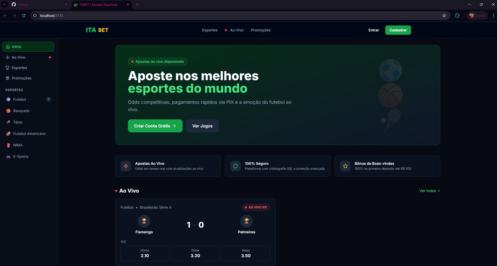
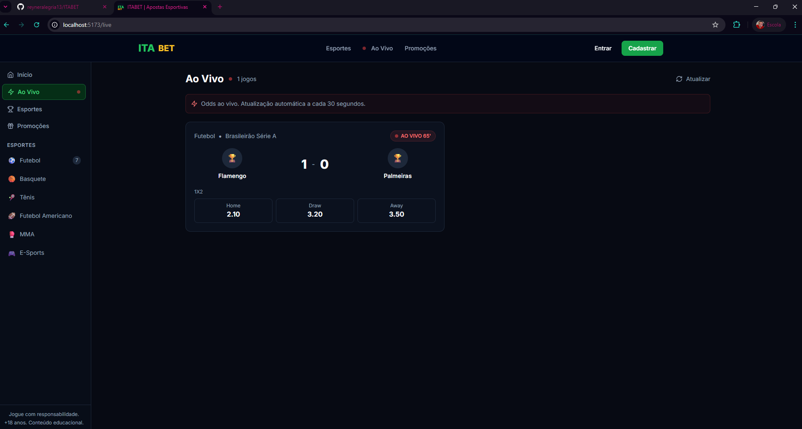
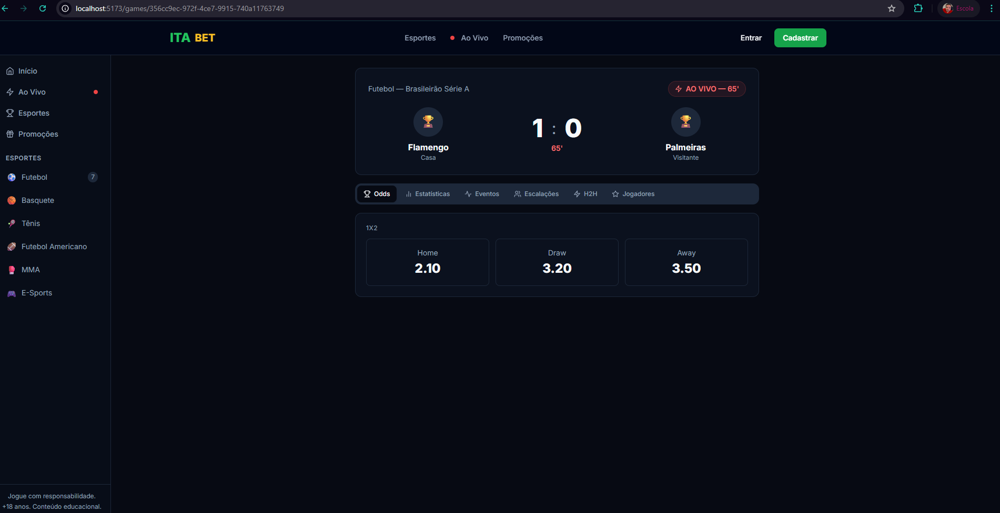
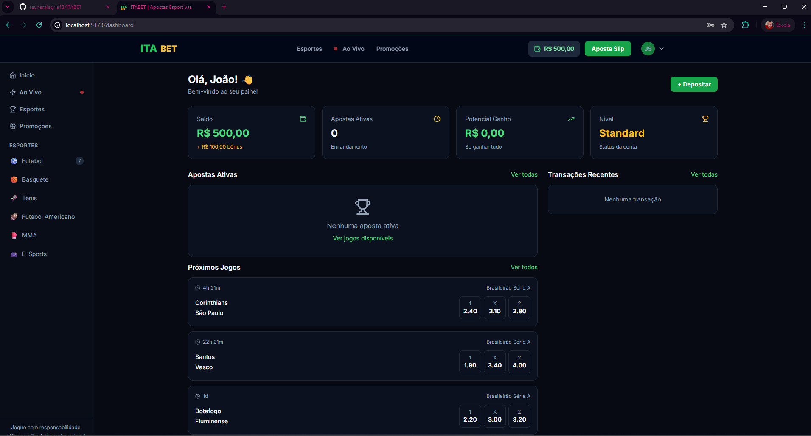
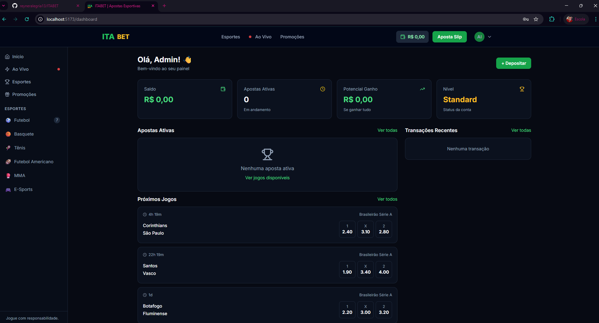

# ITABET — Plataforma de Apostas Esportivas

> Projeto universitário: Plataforma completa de apostas esportivas com segurança, APIs em tempo real e sistema de pagamentos.

---

## Screenshots

### Página Inicial — Home


### Apostas ao Vivo


### Página do Jogo (Stats, Eventos, Escalações)


### Carteira & Pagamentos


### Painel Admin


---

## Stack Tecnológica

### Backend
| Tecnologia | Função |
|---|---|
| Node.js + Express | Servidor HTTP |
| TypeScript | Tipagem estática |
| Prisma + SQLite | ORM + Banco de dados |
| Socket.IO | Eventos em tempo real |
| JWT + bcrypt | Autenticação segura |
| Stripe | Processamento de pagamentos |
| The Odds API | Dados esportivos em tempo real |
| Winston | Logging estruturado |
| Zod | Validação de schemas |

### Frontend
| Tecnologia | Função |
|---|---|
| React 18 + Vite | Framework UI |
| TypeScript | Tipagem estática |
| Tailwind CSS | Estilização |
| React Query | Cache e sincronização de dados |
| Zustand | Gerenciamento de estado |
| Socket.IO Client | WebSocket em tempo real |
| React Hook Form + Zod | Formulários validados |
| Stripe React | Pagamentos no frontend |

---

## Arquitetura de Segurança

```
┌─────────────────────────────────────────────────┐
│                   CAMADAS DE SEGURANÇA            │
├─────────────────────────────────────────────────┤
│  1. Helmet.js       → HTTP Security Headers     │
│  2. CORS            → Origem controlada          │
│  3. Rate Limiting   → Brute force prevention    │
│  4. Input Sanitize  → XSS / Injection prevention│
│  5. HPP             → HTTP Param Pollution      │
│  6. JWT + Refresh   → Token rotation seguro     │
│  7. bcrypt (12 rounds) → Password hashing      │
│  8. Account lockout → 5 tentativas → 30min lock │
│  9. Audit Logs      → Rastreio de eventos       │
│ 10. Zod validation  → Validação de entrada      │
└─────────────────────────────────────────────────┘
```

### Proteções implementadas
- **SQL Injection**: Prisma usa queries parametrizadas por padrão
- **XSS**: Sanitização de inputs + CSP headers via Helmet
- **CSRF**: SameSite cookies + Origin validation
- **Brute Force**: Rate limiting por IP + account lockout
- **Token Hijacking**: Refresh token rotation com detecção de reutilização
- **DoS**: Rate limiting global (100 req/15min) e por endpoint
- **HTTP Parameter Pollution**: HPP middleware
- **Sensitive Data Exposure**: Logs separados, respostas sem stack trace em produção

---

## Estrutura do Projeto

```
ITABET/
├── backend/
│   ├── prisma/
│   │   ├── schema.prisma     # Schema do banco (Users, Games, Bets, etc.)
│   │   └── seed.ts           # Dados iniciais
│   ├── src/
│   │   ├── controllers/      # Lógica de negócio
│   │   │   ├── authController.ts
│   │   │   ├── betController.ts
│   │   │   ├── paymentController.ts
│   │   │   ├── gameController.ts
│   │   │   ├── userController.ts
│   │   │   └── adminController.ts
│   │   ├── middleware/
│   │   │   ├── auth.ts       # JWT authentication
│   │   │   ├── security.ts   # Rate limiters, sanitização
│   │   │   ├── validate.ts   # Zod validation
│   │   │   └── errorHandler.ts
│   │   ├── routes/           # Rotas da API
│   │   ├── services/
│   │   │   └── oddsService.ts # The Odds API integration
│   │   ├── socket/
│   │   │   └── index.ts      # Socket.IO real-time
│   │   ├── utils/
│   │   │   ├── jwt.ts        # JWT + refresh tokens
│   │   │   └── logger.ts     # Winston logging
│   │   └── index.ts          # Entry point
│   └── .env.example
│
├── frontend/
│   └── src/
│       ├── components/
│       │   ├── layout/       # Navbar, Sidebar, Layouts
│       │   ├── auth/         # Protected routes
│       │   └── betting/      # GameCard, BetSlip, LiveTicker
│       ├── pages/
│       │   ├── auth/         # Login, Register
│       │   ├── admin/        # Painel admin
│       │   ├── HomePage.tsx
│       │   ├── SportsPage.tsx
│       │   ├── LivePage.tsx
│       │   ├── GamePage.tsx
│       │   ├── WalletPage.tsx
│       │   ├── BetHistoryPage.tsx
│       │   └── ProfilePage.tsx
│       ├── stores/
│       │   ├── authStore.ts  # Zustand auth state
│       │   └── betSlipStore.ts # Bet slip state
│       └── lib/
│           ├── api.ts        # Axios + auto-refresh
│           ├── socket.ts     # Socket.IO client
│           └── utils.ts      # Helpers
│
├── setup.bat                 # Script de setup Windows
└── README.md
```

---

## API Endpoints

### Autenticação
| Method | Endpoint | Descrição |
|---|---|---|
| POST | `/api/auth/register` | Cadastro (com validação CPF) |
| POST | `/api/auth/login` | Login (com lockout) |
| POST | `/api/auth/refresh` | Renovar access token |
| POST | `/api/auth/logout` | Logout |
| GET  | `/api/auth/me` | Dados do usuário logado |

### Jogos
| Method | Endpoint | Descrição |
|---|---|---|
| GET | `/api/games/sports` | Lista de esportes |
| GET | `/api/games/live` | Jogos ao vivo |
| GET | `/api/games/upcoming` | Próximos jogos |
| GET | `/api/games/:id` | Detalhes de um jogo |

### Apostas
| Method | Endpoint | Descrição |
|---|---|---|
| POST | `/api/bets` | Fazer aposta |
| GET  | `/api/bets/active` | Apostas ativas |
| GET  | `/api/bets/:id` | Detalhes de uma aposta |

### Pagamentos
| Method | Endpoint | Descrição |
|---|---|---|
| GET  | `/api/payments/balance` | Saldo atual |
| POST | `/api/payments/deposit` | Depósito (PIX/Cartão) |
| POST | `/api/payments/withdraw` | Saque via PIX |
| POST | `/api/payments/webhook/stripe` | Webhook Stripe |

### Admin (requer role ADMIN)
| Method | Endpoint | Descrição |
|---|---|---|
| GET   | `/api/admin/stats` | Dashboard stats |
| GET   | `/api/admin/users` | Lista usuários |
| PATCH | `/api/admin/users/:id/status` | Banir/Suspender |
| GET   | `/api/admin/withdrawals/pending` | Saques pendentes |
| PATCH | `/api/admin/withdrawals/:id` | Aprovar/Rejeitar saque |
| POST  | `/api/admin/games/settle` | Liquidar apostas de jogo |
| POST  | `/api/admin/games/sync` | Sincronizar jogos da API |

---

## Socket.IO Events

### Client → Server
| Evento | Payload | Descrição |
|---|---|---|
| `subscribe:game` | `gameId: string` | Assinar atualizações de jogo |
| `unsubscribe:game` | `gameId: string` | Cancelar assinatura |
| `subscribe:sport` | `sportSlug: string` | Assinar esporte |

### Server → Client
| Evento | Payload | Descrição |
|---|---|---|
| `game:update` | Score, odds, minuto | Atualização de jogo ao vivo |
| `live:games` | Array de jogos | Lista de jogos ao vivo |
| `balance:update` | balance, bonusBalance | Saldo atualizado |
| `bet:result` | betId, status, actualWin | Resultado de aposta |
| `odds:change` | gameId, selections | Mudança de odds |

---

## Configuração

### 1. Requisitos
- Node.js 18+
- npm 8+

### 2. Setup automático (Windows)
```bash
# Execute o setup.bat
setup.bat
```

### 3. Setup manual
```bash
# Backend
cd backend
npm install
copy .env.example .env
# Edite .env com suas chaves!
npx prisma generate
npx prisma migrate dev --name init
npx tsx prisma/seed.ts

# Frontend
cd ../frontend
npm install
```

### 4. Variáveis de ambiente (`backend/.env`)
```env
DATABASE_URL="file:./dev.db"
JWT_SECRET=sua_chave_super_secreta_minimo_32_chars
COOKIE_SECRET=outra_chave_secreta

# Stripe (https://dashboard.stripe.com)
STRIPE_SECRET_KEY=sk_test_...
STRIPE_WEBHOOK_SECRET=whsec_...

# The Odds API (https://the-odds-api.com - free tier)
ODDS_API_KEY=sua_chave_aqui

# PIX (sua chave pix para receber)
PIX_KEY=seuemail@exemplo.com
```

### 5. Iniciar
```bash
# Terminal 1 — Backend
cd backend && npm run dev

# Terminal 2 — Frontend
cd frontend && npm run dev
```

Acesse: **http://localhost:5173**

---

## Contas de teste
| Conta | Email | Senha |
|---|---|---|
| Super Admin | admin@itabet.com | Admin@123456 |
| Usuário Demo | demo@itabet.com | User@123456 |

---

## Banco de Dados — Modelo ER (simplificado)

```
User ──────< Bet >────── Game ──────> Sport
  │              │           │
  │              └──< BetSelection >── Selection >── Market
  │
  ├──────< Transaction
  ├──────< RefreshToken
  └──────< AuditLog
```

---

## Funcionalidades

### Usuário
- [x] Cadastro com validação de CPF e idade mínima (18 anos)
- [x] Login com proteção contra brute force
- [x] Refresh token automático
- [x] Perfil e alteração de senha
- [x] Histórico de apostas e transações

### Apostas
- [x] Aposta simples (1 jogo)
- [x] Aposta múltipla (acumulador)
- [x] Bet slip com cálculo de odds
- [x] Apostas com saldo bônus
- [x] Liquidação automática de apostas

### Jogos em Tempo Real
- [x] WebSocket com Socket.IO
- [x] Ticker de placar ao vivo
- [x] Integração com The Odds API
- [x] Dados de demonstração (quando sem API key)

### Pagamentos
- [x] Depósito via PIX (QR Code)
- [x] Depósito via cartão (Stripe)
- [x] Saque via PIX
- [x] Webhook Stripe
- [x] Histórico de transações

### Admin
- [x] Dashboard com métricas em tempo real
- [x] Gestão de usuários (banir/suspender)
- [x] Aprovação de saques
- [x] Liquidação de apostas
- [x] Sincronização de jogos

---

*ITABET — Projeto Universitário de Disciplina. Uso educacional.*
